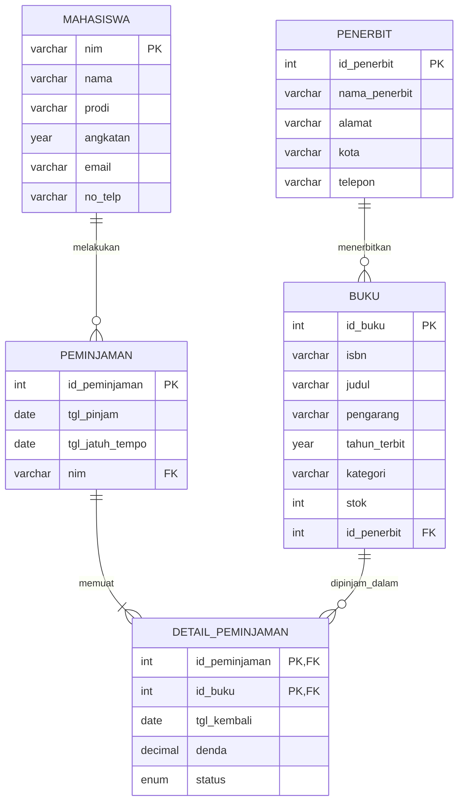

# Perancangan ERD E-Library Kampus

## 1. Deskripsi Kasus
Sistem perpustakaan kampus mencatat data mahasiswa, buku, penerbit, serta
riwayat peminjaman dan pengembalian buku. Satu transaksi peminjaman dapat
memuat lebih dari satu buku.

## 2. Entitas dan Atribut

| Entitas | Atribut | PK | FK |
|---|---|---|---|
| Mahasiswa | nim, nama, prodi, angkatan, email, no_telp | nim | - |
| Penerbit | id_penerbit, nama_penerbit, alamat, kota, telepon | id_penerbit | - |
| Buku | id_buku, isbn, judul, pengarang, tahun_terbit, kategori, stok, id_penerbit | id_buku | id_penerbit |
| Peminjaman | id_peminjaman, tgl_pinjam, tgl_jatuh_tempo, nim | id_peminjaman | nim |
| Detail_Peminjaman | id_peminjaman, id_buku, tgl_kembali, denda, status | (id_peminjaman, id_buku) | id_peminjaman, id_buku |

Catatan: Entitas "Transaksi Peminjaman" dipecah menjadi `Peminjaman` (header)
dan `Detail_Peminjaman` (isi). Pemecahan ini muncul secara alami dari proses
normalisasi (menghilangkan repeating group pada 1NF) dan sekaligus
menyelesaikan relasi many-to-many antara Peminjaman dan Buku.

## 3. Relasi Antar Entitas

| Relasi | Kardinalitas | Keterangan |
|---|---|---|
| Penerbit - Buku | 1 : N | Satu penerbit menerbitkan banyak buku |
| Mahasiswa - Peminjaman | 1 : N | Satu mahasiswa dapat melakukan banyak peminjaman |
| Peminjaman - Detail_Peminjaman | 1 : N | Satu transaksi berisi satu atau lebih buku |
| Buku - Detail_Peminjaman | 1 : N | Satu buku dapat muncul di banyak transaksi (dari waktu ke waktu) |

## 4. Simulasi Normalisasi

### 4.1 UNF (Unnormalized Form)
Data mentah satu lembar transaksi peminjaman. Tanda `{ }` = kelompok berulang.

Peminjaman(
no_transaksi, tgl_pinjam, tgl_jatuh_tempo,
nim, nama_mhs, prodi, email,
{ id_buku, isbn, judul, pengarang, tahun_terbit,
  id_penerbit, nama_penerbit, kota_penerbit,
  tgl_kembali, denda }
)

Contoh data:

| no_transaksi | tgl_pinjam | nim | nama_mhs | prodi | buku yang dipinjam |
|---|---|---|---|---|---|
| TRX001 | 2026-09-01 | H071231001 | Andi | Informatika | B01 Basis Data (Erlangga); B02 Jaringan (Informatika) |
| TRX002 | 2026-09-03 | H071231002 | Sari | Informatika | B01 Basis Data (Erlangga) |

Masalah: satu sel berisi banyak nilai (kolom buku berulang).

### 4.2 1NF (First Normal Form)
Aturan: setiap sel atomik, tidak ada kelompok berulang. Satu baris = satu buku
dalam satu transaksi. Primary key gabungan: (no_transaksi, id_buku).

| no_transaksi | id_buku | tgl_pinjam | tgl_jatuh_tempo | nim | nama_mhs | prodi | email | isbn | judul | pengarang | tahun_terbit | id_penerbit | nama_penerbit | kota_penerbit | tgl_kembali | denda |
|---|---|---|---|---|---|---|---|---|---|---|---|---|---|---|---|---|
| TRX001 | B01 | 2026-09-01 | 2026-09-08 | H071231001 | Andi | Informatika | andi@mail.com | 978-1 | Basis Data | Budi | 2020 | P01 | Erlangga | Jakarta | 2026-09-07 | 0 |
| TRX001 | B02 | 2026-09-01 | 2026-09-08 | H071231001 | Andi | Informatika | andi@mail.com | 978-2 | Jaringan | Dewi | 2019 | P02 | Informatika | Bandung | 2026-09-10 | 2000 |
| TRX002 | B01 | 2026-09-03 | 2026-09-10 | H071231002 | Sari | Informatika | sari@mail.com | 978-1 | Basis Data | Budi | 2020 | P01 | Erlangga | Jakarta | NULL | 0 |

Masalah: data mahasiswa dan buku berulang (redundansi).

### 4.3 2NF (Second Normal Form)
Aturan: sudah 1NF dan tidak ada ketergantungan parsial (atribut non-key
bergantung pada sebagian PK gabungan saja).

Analisis ketergantungan fungsional:
- no_transaksi -> tgl_pinjam, tgl_jatuh_tempo, nim, nama_mhs, prodi, email (parsial)
- id_buku -> isbn, judul, pengarang, tahun_terbit, id_penerbit, nama_penerbit, kota_penerbit (parsial)
- (no_transaksi, id_buku) -> tgl_kembali, denda (penuh)

Hasil dekomposisi:

**Peminjaman**(**no_transaksi**, tgl_pinjam, tgl_jatuh_tempo, nim, nama_mhs, prodi, email)

**Buku**(**id_buku**, isbn, judul, pengarang, tahun_terbit, id_penerbit, nama_penerbit, kota_penerbit)

**Detail_Peminjaman**(**no_transaksi, id_buku**, tgl_kembali, denda)

Masalah tersisa: masih ada ketergantungan transitif.

### 4.4 3NF (Third Normal Form)
Aturan: sudah 2NF dan tidak ada ketergantungan transitif (atribut non-key
bergantung pada atribut non-key lain).

Ketergantungan transitif:
- Di Peminjaman: no_transaksi -> nim -> nama_mhs, prodi, email
- Di Buku: id_buku -> id_penerbit -> nama_penerbit, kota_penerbit

Hasil dekomposisi akhir (3NF):

1. **Mahasiswa**(**nim**, nama, prodi, angkatan, email, no_telp)
2. **Penerbit**(**id_penerbit**, nama_penerbit, alamat, kota, telepon)
3. **Buku**(**id_buku**, isbn, judul, pengarang, tahun_terbit, kategori, stok, *id_penerbit*)
4. **Peminjaman**(**id_peminjaman**, tgl_pinjam, tgl_jatuh_tempo, *nim*)
5. **Detail_Peminjaman**(***id_peminjaman, id_buku***, tgl_kembali, denda, status)

Semua atribut non-key kini hanya bergantung pada primary key, seluruh PK,
dan tidak ada yang lain.

## 5. Rancangan Tabel Akhir

### 5.1 Tabel `mahasiswa`
| Kolom | Tipe Data | Kunci | Keterangan |
|---|---|---|---|
| nim | VARCHAR(12) | PK | Nomor induk mahasiswa |
| nama | VARCHAR(100) | | NOT NULL |
| prodi | VARCHAR(50) | | NOT NULL |
| angkatan | YEAR | | |
| email | VARCHAR(100) | | UNIQUE |
| no_telp | VARCHAR(15) | | |

### 5.2 Tabel `penerbit`
| Kolom | Tipe Data | Kunci | Keterangan |
|---|---|---|---|
| id_penerbit | INT AUTO_INCREMENT | PK | |
| nama_penerbit | VARCHAR(100) | | NOT NULL |
| alamat | VARCHAR(200) | | |
| kota | VARCHAR(50) | | |
| telepon | VARCHAR(15) | | |

### 5.3 Tabel `buku`
| Kolom | Tipe Data | Kunci | Keterangan |
|---|---|---|---|
| id_buku | INT AUTO_INCREMENT | PK | |
| isbn | VARCHAR(20) | | UNIQUE |
| judul | VARCHAR(150) | | NOT NULL |
| pengarang | VARCHAR(100) | | NOT NULL |
| tahun_terbit | YEAR | | |
| kategori | VARCHAR(50) | | |
| stok | INT | | DEFAULT 0 |
| id_penerbit | INT | FK | Referensi ke penerbit(id_penerbit) |

### 5.4 Tabel `peminjaman`
| Kolom | Tipe Data | Kunci | Keterangan |
|---|---|---|---|
| id_peminjaman | INT AUTO_INCREMENT | PK | |
| tgl_pinjam | DATE | | NOT NULL |
| tgl_jatuh_tempo | DATE | | NOT NULL |
| nim | VARCHAR(12) | FK | Referensi ke mahasiswa(nim) |

### 5.5 Tabel `detail_peminjaman`
| Kolom | Tipe Data | Kunci | Keterangan |
|---|---|---|---|
| id_peminjaman | INT | PK, FK | Referensi ke peminjaman(id_peminjaman) |
| id_buku | INT | PK, FK | Referensi ke buku(id_buku) |
| tgl_kembali | DATE | | NULL jika belum dikembalikan |
| denda | DECIMAL(10,2) | | DEFAULT 0 |
| status | ENUM('dipinjam','dikembalikan','terlambat') | | DEFAULT 'dipinjam' |

## 6. Visualisasi ERD (Mermaid)

## 7. Ringkasan Relasi Kunci (Diagram Alur Teks)

mahasiswa.nim ─────────────< peminjaman.nim
penerbit.id_penerbit ──────< buku.id_penerbit
peminjaman.id_peminjaman ──< detail_peminjaman.id_peminjaman
buku.id_buku ──────────────< detail_peminjaman.id_buku

(Simbol `<` menunjukkan sisi "banyak" pada relasi 1:N)

## 8. Kesimpulan
Rancangan telah memenuhi 3NF: tidak ada kelompok berulang, ketergantungan
parsial, maupun ketergantungan transitif. Redundansi data mahasiswa, buku,
dan penerbit dihilangkan, sehingga integritas dan konsistensi data terjaga.