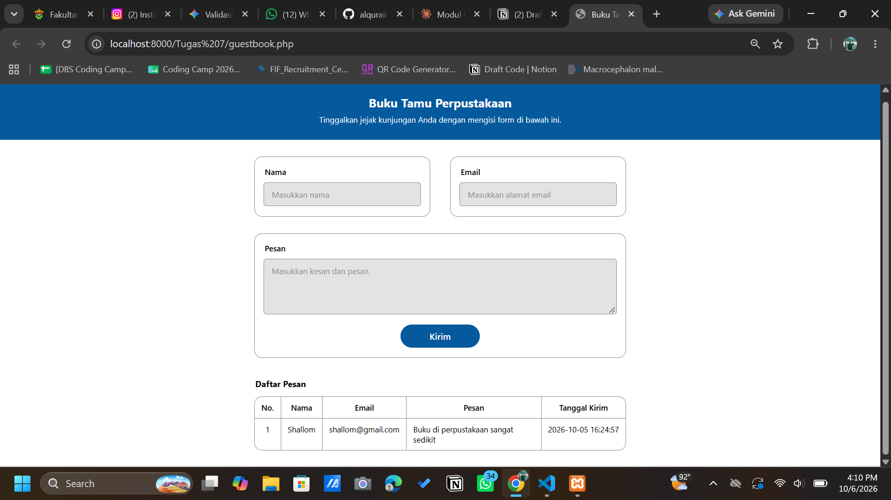

# Modul Buku Tamu Perpustakaan Berbasis PDO

Tugas Mandiri mata kuliah **Pemrograman Web** (Tugas 7).

Modul buku tamu digital untuk perpustakaan. Pengunjung menulis pesan lewat formulir, pesan disimpan ke MySQL/MariaDB menggunakan PDO, dan daftar pesan ditampilkan di halaman yang sama.

## Fitur

- Formulir input **Nama**, **Email**, dan **Pesan**
- Akses data memakai **PDO** dengan *prepared statements* pada query `INSERT` dan `SELECT`
- Daftar pesan tampil di halaman yang sama, diurutkan dari yang terbaru
- Validasi masukan di sisi server
- Perlindungan berlapis: token CSRF, sanitasi keluaran, dan prepared statements
- Pola *Post/Redirect/Get* agar pesan tidak terkirim ganda saat halaman di-refresh
- Tampilan responsif sesuai desain UI

## Teknologi

| Komponen | Keterangan |
|---|---|
| Bahasa | PHP 8.x (`declare(strict_types=1)`) |
| Basis data | MySQL / MariaDB |
| Akses data | PDO (`pdo_mysql`) |
| Lingkungan lokal | XAMPP (atau Laragon), VS Code |

## Struktur Berkas

```
.
├── classes/
│   └── GuestBook.php          # Kelas akses data (simpan, ambilSemua, validasi)
├── database/
│   ├── buku_tamu.sql          # Skema database dan tabel (tanpa data)
│   └── buku_tamu_dump.sql     # Skema + data contoh (hasil ekspor)
├── guestbook.php              # Halaman form dan tabel daftar pesan
└── README.md
```

> `GuestBook.php` ditempatkan di subfolder `classes/` karena Windows dan macOS tidak membedakan huruf besar/kecil pada nama berkas, sehingga `GuestBook.php` dan `guestbook.php` tidak bisa berada di folder yang sama.

## Database

Dua berkas SQL disediakan sesuai kebutuhan:

| Berkas | Isi | Dipakai untuk |
|---|---|---|
| [`database/buku_tamu.sql`](database/buku_tamu.sql) | Skema saja (`CREATE DATABASE` dan `CREATE TABLE`) | Dokumentasi rancangan tabel, atau memulai dengan tabel kosong |
| [`database/buku_tamu_dump.sql`](database/buku_tamu_dump.sql) | Skema beserta data contoh | Langsung mencoba aplikasi dengan data yang sudah terisi |

Impor **salah satu** saja. Data pada berkas dump adalah data fiktif.

### Rancangan tabel

Tabel `buku_tamu` pada database `perpustakaan`:

| Kolom | Tipe | Keterangan |
|---|---|---|
| `id` | `INT UNSIGNED` | Primary key, auto increment |
| `nama` | `VARCHAR(100)` | Wajib diisi |
| `email` | `VARCHAR(150)` | Wajib diisi |
| `pesan` | `TEXT` | Wajib diisi |
| `tanggal_kirim` | `DATETIME` | Default `CURRENT_TIMESTAMP` |

## Kebutuhan Sistem

- PHP 8.0 atau lebih baru dengan ekstensi `pdo_mysql` aktif
- MySQL atau MariaDB
- Apache atau PHP built-in server

## Cara Menjalankan

### 1. Siapkan database

Nyalakan layanan **MySQL**, lalu impor berkas SQL (pilih skema saja atau dump dengan data contoh).

**phpMyAdmin**

1. Buka `http://localhost/phpmyadmin`
2. Pilih tab **Import**
3. Pilih `database/buku_tamu_dump.sql` (atau `buku_tamu.sql`), lalu klik **Import**

**Terminal MySQL**

```sql
source /path/ke/proyek/database/buku_tamu_dump.sql
```

Cek hasilnya:

```sql
USE perpustakaan;
SELECT * FROM buku_tamu;
```

### 2. Sesuaikan koneksi

Di `guestbook.php`, sesuaikan dengan pengaturan MySQL kamu:

```php
$dsn  = 'mysql:host=localhost;dbname=perpustakaan;charset=utf8mb4';
$user = 'root';
$pass = '';   // kosong untuk XAMPP bawaan
```

### 3. Jalankan aplikasi

**Opsi A: PHP built-in server** (dari folder proyek)

```bash
php -S localhost:8000
```

Jika `php` tidak dikenali, pakai path lengkap ke `php.exe` milik instalasi kamu, misalnya:

```powershell
& "D:\XAMPP\php\php.exe" -S localhost:8000
```

Buka `http://localhost:8000/guestbook.php`. MySQL tetap harus menyala.

**Opsi B: Apache (XAMPP)**

1. Salin folder proyek ke `htdocs`
2. Nyalakan **Apache** dan **MySQL**
3. Buka `http://localhost/nama-folder-proyek/guestbook.php`

## Aturan Validasi

| Kolom | Aturan |
|---|---|
| Nama | Tidak boleh kosong (setelah `trim`), maksimal 100 karakter |
| Email | Format valid (`FILTER_VALIDATE_EMAIL`), maksimal 150 karakter |
| Pesan | Minimal 5 karakter (dihitung dengan `mb_strlen`) |

## Keamanan

| Ancaman | Pertahanan |
|---|---|
| **CSRF** | Token acak `random_bytes(32)` disimpan di session, dikirim lewat hidden input, diverifikasi dengan `hash_equals()`, dan diganti setelah pengiriman berhasil |
| **XSS** | Semua keluaran disanitasi dengan `htmlspecialchars(..., ENT_QUOTES, 'UTF-8')` melalui fungsi `e()` |
| **SQL Injection** | Prepared statements dengan parameter terikat; `PDO::ATTR_EMULATE_PREPARES` dimatikan |
| Kebocoran informasi | `ERRMODE_EXCEPTION`; pesan error dicatat ke log dan tidak ditampilkan ke pengguna |

Pengguna `root` tanpa password hanya untuk pengembangan lokal. Di server sungguhan, gunakan pengguna database khusus dengan hak akses terbatas.

## Pengujian Manual

| Skenario | Hasil yang diharapkan |
|---|---|
| Kirim form dengan semua kolom kosong | Muncul pesan error validasi |
| Email tanpa `@` | Error "Format email tidak valid." |
| Pesan kurang dari 5 karakter | Error "Pesan minimal 5 karakter." |
| Semua kolom diisi benar | Pesan sukses tampil dan data muncul di tabel |
| Pesan `<script>alert(1)</script>` | Tampil sebagai teks biasa, tidak ada popup |
| Hapus nilai `csrf_token` lewat DevTools lalu submit | Ditolak dengan status 403 |
| Refresh halaman setelah mengirim | Pesan tidak terkirim ganda |

## Pemecahan Masalah

| Masalah | Solusi |
|---|---|
| `Can't connect to MySQL server` (error 2003) | MySQL belum menyala. Start MySQL di XAMPP Control Panel |
| `could not find driver` | Aktifkan `extension=pdo_mysql` di `php.ini`, lalu restart server |
| `Koneksi database gagal.` | Periksa nama database, username, dan password di `guestbook.php` |
| `404 Not Found` di built-in server | Jalankan server dari folder yang berisi `guestbook.php`, atau buka alamat `/guestbook.php` |
| Halaman kosong | Periksa log error PHP atau Apache |

## Tampilan

Tambahkan tangkapan layar halaman di sini, misalnya `docs/screenshot.png`:

```markdown

```